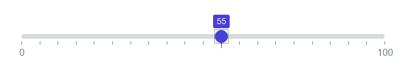
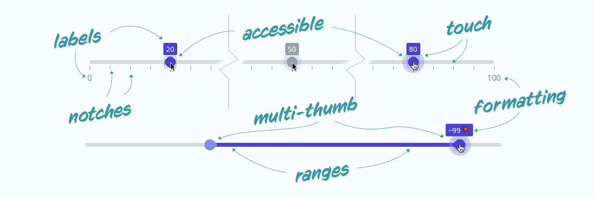

# Range Slider (with pips)

## [`svelte-range-slider-pips`](https://www.npmjs.com/package/svelte-range-slider-pips) @ **npm**

A reactive, accessible, multi-thumb, range slider with the ability to display "pips" or "notches" along the range. Importable as a svelte-component, or used directly in any javascript application.



---

📔 | External | [_Full Documentation & Examples_](https://simeydotme.github.io/svelte-range-slider-pips/)
:--: | -----: | :------
💲 | **REPL** |[_Svelte component demo_](https://svelte.dev/repl/030797781fd64ad88302d1343f5b2c43?version=3.32.1)
❤ | **Codepen** |[_Plain JS component demo_](https://codepen.io/simeydotme/pen/KKNJdbK)

---

## features



- ✨ fully customisable, stylable & accessible
- 👍🏽 multi-thumb
- 🎚 range (min/max)
- 🏷 floating labels
- 📏 ruler notches
- 🏷 labels for notches
- 🧮 step function
- 🖍 formatter
- 🎭 animated

## install

Open your project and use the command line to install the package;

```bash
yarn add svelte-range-slider-pips --dev          # or
npm install svelte-range-slider-pips --save-dev  # if you prefer npm
```

## usage

### as a regular JS file

If you're not building a svelte-app, you can use the [`/dist/`
version of the script `/dist/svelte-range-slider-pips.js`](dist/svelte-range-slider-pips.js) and include it
either with a regular `<script>` tag. This should even work with jQuery.

```html
<script src="./js/vendor/svelte-range-slider-pips.js" />

<div id="my-slider"></div>

<script>
  var mySlider = new RangeSliderPips({
    target: document.getElementById("my-slider"),
    props: { /* props as js object */ }
  });
</script>
```

### in a svelte project

Assuming you have a Svelte app up and running;

```html
<script>
  import RangeSlider from "svelte-range-slider-pips";
</script>

<RangeSlider />
```

### as a JS module

If you're building a bleeding-edge JS application (not svelte), you might
want to use js imports (`import`)

```js
import RangeSlider from "./node_modules/svelte-range-slider-pips/dist/svelte-range-slider-pips.mjs";

var mySlider = new RangeSlider({
  target: node, // js reference to a DOM element
  props: { /* props as js object */ }
});
```

---

## props (options)

### slider props

prop | type | default | description
-----|------|---------|-------------
**values** | `Array` | `[50]` | Array of values to apply on the slider. Multiple values creates multiple handles. (_**note:** A slider with `range` property set can only have two values max_)
**min** | `Number` | `0` | Minimum value for the slider
**max** | `Number` | `100` | Maximum value for the slider
**step** | `Number` | `1` | Every `nth` value to allow handle to stop at
**range** | `Boolean`/`String` | `false` | Whether to style as a range picker. Use `range='min'` or `range='max'` for min/max variants
**pushy** | `Boolean` | `false` | If `range` is `true`, then this boolean decides if one handle will push the other along
**float** | `Boolean` | `false` | Set true to add a floating label above focussed handles
**vertical** | `Boolean` | `false` | Make the slider render vertically
**pips** | `Boolean` | `false` | Whether to show pips/notches on the slider
**pipstep** | `Number` | `1`/`10`/`20` | Every `nth` step to show a pip for. This has multiple defaults depending on `values` property
**first** | `Boolean`/`String` | `false` | Whether to show a pip or label for the first value on slider. Use `first='label'` to show a label value
**last** | `Boolean`/`String` | `false` | Whether to show a pip or label for the last value on slider. Use `last='label'` to show a label value
**rest** | `Boolean`/`String` | `false` | Whether to show a pip or label for all other values. Use `rest='label'` to show a label value
**all** | `Boolean`/`String` | `false` | Whether to show a pip or label for all values. Same as combining `first`, `last` and `rest`. Use `all='label'` to show a label value
**prefix** | `String` | `""` | A string to prefix to all displayed values
**suffix** | `String` | `""` | A string to suffix to all displayed values
**disabled** | `Boolean` | `false` | Determine if the slider is disabled, or enabled _(only disables interactions, and events)_
**formatter** | `Function` | `(v) => v` | A function to re-format values before they are displayed
**handleFormatter** | `Function` | `formatter` | A function to re-format values on the handle/float before they are displayed. Defaults to the same function given to the `formatter` property
**springValues** | `Object` | `{ stiffness: 0.15, damping: 0.4 }` | Svelte spring physics object to change the behaviour of the handle when moving

### slider events (dispatched)

event | example | `event.detail` | description
------|------------|--------|-------------
**start** | `on:start={(e) => { ... }}` | `{ activeHandle: Integer, value: Float, values: Array }` | Event fired when the user begins interaction with the slider
**change** | `on:change={(e) => { ... }}` | `{ activeHandle: Integer, startValue: Float, previousValue: Float, value: Float, values: Array }` | Event fired when the user changes the value; returns the previous value, also
**stop** | `on:stop={(e) => { ... }}` | `{ activeHandle: Integer, startValue: Float, value: Float, values: Array }` | Event fired when the user stops interacting with slider; returns the beginning value, also

**[📔📘📖 _Full Documentation & Examples_](https://simeydotme.github.io/svelte-range-slider-pips/)**

## contribute

I am very happy to accept;

- 🌟 suggestions/requests for new features or changes
- 🛠 pull-requests for bug fixes, or issue resolution
- 🧪 help with creating a proper test-suite

[Read the CONTRIBUTING.md](./CONTRIBUTING.md)
